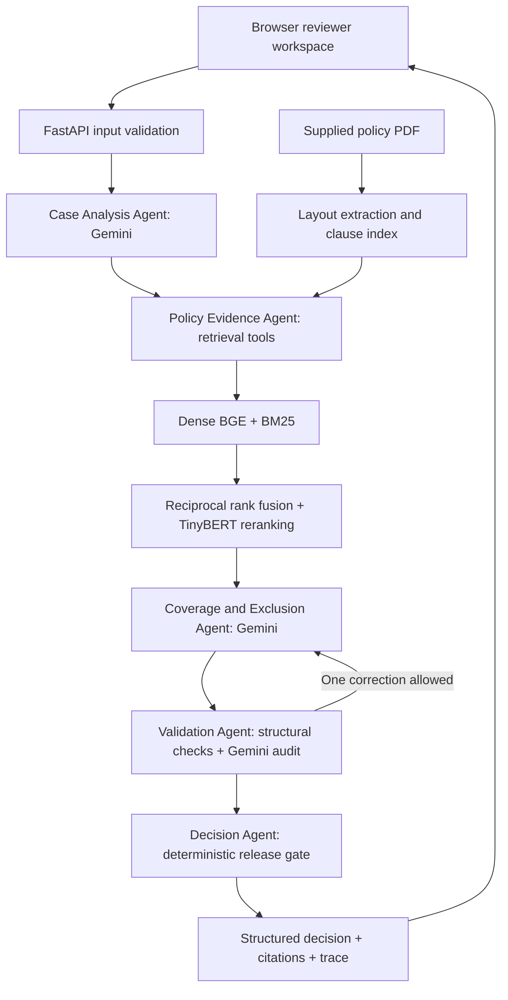

# Policy Review

A policy-grounded health insurance claim review service built for the Aptino AI Engineer assignment. It returns a machine-readable decision, source clauses, conditional limits, missing evidence and an auditable execution trace.

The application uses **Gemini through LangChain**, **LangGraph**, **FastAPI**, local **BGE embeddings**, **BM25**, reciprocal rank fusion and a **TinyBERT cross-encoder reranker**. A lightweight browser frontend is served by FastAPI, so the website and API share one deployment.

## Run locally

Python 3.10+ is required; the tested environment uses Python 3.12. A first run downloads approximately 70 MB of public model weights. Use a machine with at least 2 GB available memory; indexing uses small batches.

```bash
python -m venv .venv
# Windows PowerShell
.venv\Scripts\Activate.ps1
# macOS / Linux: source .venv/bin/activate
pip install -r requirements.lock.txt
cp .env.example .env
```

On Windows, use `Copy-Item .env.example .env` if `cp` is unavailable. Enter your key in `.env`:

```dotenv
GOOGLE_API_KEY=your_key_here
GEMINI_MODEL=gemini-3.1-flash-lite
```

Do not commit `.env`. Credentials are read only by the backend, never sent to the frontend. Run:

```bash
python -m scripts.check_connection
python -m scripts.build_index
uvicorn app.main:app --host 0.0.0.0 --port 7860
```

Open `http://localhost:7860`. The API documentation is at `/docs`. `/health` returns 503 until the index is loaded and a model key is configured. Readiness does not perform a billable model call; `check_connection` does.

Model calls are paced by `MODEL_MIN_INTERVAL_SECONDS` (13 seconds by default) to accommodate a low-quota key. A review typically takes tens of seconds and can take longer if validation requests a correction. The evaluation report records measured local timings. Each server process has its own rate limiter; use one worker on a free-tier deployment.

## Architecture



The graph passes a typed state containing the case, investigation plan, evidence, assessment and validation report. Each specialist has a different input/output contract. The retrieval agent executes independent searches across decision dimensions, not one question against the entire policy. The decision agent never publishes an unvalidated draft.

## Policy ingestion and retrieval

`app/ingestion.py` reads the supplied PDF in layout mode. It splits at named definitions, numbered clauses, major headings, NB provisions and paragraph boundaries. It keeps cross-page provisions intact and preserves their complete page list. Clause IDs hash the source fingerprint, pages and extracted text.

Two source-specific issues are handled explicitly:

* Page 8 has a content-stream order that differs from its visual reading order; layout extraction restores it.
* On page 10, the domiciliary parent is numbered 17 and its conditions are numbered 18–20. These stay in one context so a home-treatment restriction is not applied to every inpatient claim.

Dense vectors are persisted as a fingerprinted NumPy index. Exact cosine search is appropriate for this small, single-policy corpus; there is no external vector database to operate. BM25 independently scores lexical overlap. Each query retrieves 12 candidates per method; reciprocal rank fusion uses `k=60`, followed by cross-encoder reranking of up to 18 candidates and delivery of the best 4. The output exposes query, rank, dense score, BM25 score, RRF score and rerank score.

## Decision contract

Supported statuses:

* `ADMISSIBLE`: supplied facts establish eligibility and no deduction is identified.
* `ADMISSIBLE_WITH_LIMITS`: eligibility is established and a supported cap/deduction affects the claim.
* `PARTIALLY_ADMISSIBLE`: some expenses are supported and others definitively excluded.
* `NOT_ADMISSIBLE`: an operative policy exclusion supports rejection.
* `NEEDS_REVIEW`: a material condition or the policy interpretation remains unresolved.

`reason_code` distinguishes `INSUFFICIENT_EVIDENCE`, `VALIDATION_FAILED` and `MODEL_OR_TOOL_UNAVAILABLE`. Service outages never count as correct policy abstentions in evaluation. Confidence is an explicitly uncalibrated evidence-completeness heuristic (0 for unavailable/failed validation, 0.5 for validated review, 0.85 for a validated final decision), not a model-generated probability.

Every finding and limit contains evidence IDs. Expanded citations include source, page list, section, exact clause text and chunk ID. Traces record actions, evidence IDs, validation defects and timings; no hidden chain-of-thought is requested or displayed.

## API

`POST /analyze` accepts one case in the supplied schema. Unknown/non-critical fields are tolerated, but required fields, dates and finite non-negative amounts are validated. Unsupported policies return 422; malformed input returns 422; requests over 100 KB return 413. Two concurrent review slots are available per process; excess requests receive 429. Provider failure returns 503 with a structured review result when available.

Create a request from the unchanged public dataset:

```bash
python -c "import json; c=json.load(open('data/candidate_data/public_test_cases.json')); json.dump(c[1],open('case.json','w'),indent=2)"
curl -X POST http://localhost:7860/analyze -H "Content-Type: application/json" --data-binary @case.json
curl http://localhost:7860/health
```

On Windows use `curl.exe`. If `APP_API_TOKEN` is configured, add `-H "Authorization: Bearer YOUR_REVIEWER_TOKEN"`, or enter the token in the web interface. It is never persisted by the browser.

Example response shape (illustrative; measured responses are in `evaluation/results/cases/`):

```json
{
  "case_id": "PUB-002",
  "decision": "NOT_ADMISSIBLE",
  "reason_code": null,
  "confidence": 0.85,
  "key_findings": [{
    "dimension": "initial_waiting_period",
    "statement": "The claim falls within the initial waiting period.",
    "effect": "excludes",
    "evidence_ids": ["clause-<source-derived-id>"],
    "fact_paths": ["policy_start_date", "claim_date"]
  }],
  "applicable_limits": [],
  "missing_evidence": [],
  "next_action": "Review the cited waiting-period provision.",
  "citations": [{
    "claim": "The claim falls within the initial waiting period.",
    "source": "USGIC-CSCIndividualHealthInsurance_2017-2018.pdf",
    "page": 9,
    "pages": [9],
    "section": "WHAT WE EXCLUDE / 2. 30 days Waiting Period",
    "chunk_id": "clause-<source-derived-id>",
    "quote": "<complete extracted clause>"
  }],
  "validation": {"status": "PASS", "unsupported_claims": []},
  "trace": []
}
```

The real response also contains model/version details, policy fingerprint, retrieval metadata, confidence explanation and elapsed time. `/cases` serves the 12 public cases; `/policy` serves the source PDF for citation inspection.

## Evaluation

The original 12 cases are unchanged. Nine additional cases live in `evaluation/additional_cases.json`; expected outcomes and clause anchors are frozen separately in `evaluation/expected_outcomes.json`.

```bash
pytest -q
python -m scripts.evaluate
```

The second command performs real Gemini calls and writes per-case JSON, `summary.json`, `case_metrics.json` and `case_metrics.csv` under `evaluation/results/`. It needs a working key and quota. A focused run uses `--cases PUB-002 CAND-001 --output evaluation/runs/smoke`. `--resume` reuses existing responses and discloses reused IDs in the summary. For a fresh reproducibility run, omit `--resume` and use a new output directory.

Metrics include exact decision success, validation pass rate, pooled evidence recall with four results per query, citation provenance correctness, model-validator support rate, abstention precision/recall and latency. Pooled recall is not single-query recall@4. The validator support rate is not an independent human accuracy measurement. Detailed interpretation choices, measured findings and failures are documented in `docs/EVALUATION.md`.

## Deployment

The Dockerfile serves the frontend and backend on port 7860. The same repository can be uploaded to a public **Hugging Face Docker Space** if the account has the required paid plan. Hugging Face's current creation screen requires PRO for Docker compute; static-only Spaces cannot run this backend. This README already contains the required Space metadata. Set `GOOGLE_API_KEY` as a **Space secret**, not a public variable. Set `GEMINI_MODEL` as a variable. After the build completes, verify `/health`, `/docs` and one live claim.

Alternatively, `render.yaml` supplies a Render Free Docker service configuration. Render's free instance has 512 MB RAM, so verify actual memory use and health after deployment; model loading may exceed that limit. Free services can sleep; the first request after waking may be slower. Deployment account setup is separate from the GitHub source repository.

See `docs/SUBMISSION_CHECKLIST.md` for exact handoff steps.

## Design choices and limitations

* A single Python service reduces deployment complexity; the browser frontend still invokes a real HTTP backend.
* Local embeddings and reranking keep retrieval independent of Gemini quota. Small batches limit startup memory use.
* Three Gemini roles (planning, coverage and validation) are combined with two tool/deterministic specialists. This avoids unnecessary model calls for arithmetic and response release.
* The validation pass is useful but not independent of the model family used for coverage; correlated errors remain possible.
* Source-specific clause grouping is appropriate for the one assigned policy, not a universal insurance-PDF parser.
* No OCR, policy schedule/endorsement ingestion, document-content verification, claim-history database, legal update retrieval or calibrated payout estimator is included.
* Supplied facts are treated as assertions. A named document is not assumed to contain an unprovided fact. This produces conservative review outcomes on several public cases.
* The PDF mentions an annexure of 140 day-care procedures, but that annexure is absent from the supplied 17-page file. The app cannot assert that an unlisted procedure appears there.
* Normal-room wording, domiciliary numbering and experimental-treatment interpretation require care; ambiguous claims are not silently resolved with outside insurance knowledge.
* No paid hosting, domain or extra provider subscription is required by the source code. Model calls still depend on the account's quota and billing settings.

## Project layout

```text
app/                 Typed contracts, PDF ingestion, retrieval, LangGraph workflow, API
static/              Browser interface (no frontend build required)
data/                Unchanged supplied policy, cases and package documentation
evaluation/          Additional cases, reference interpretations and measured results
scripts/             Indexing, connection check, evaluation and packaging helpers
tests/               Contract, ingestion, API and workflow regression tests
docs/                Design note, evaluation analysis and submission guidance
```

Implementation references: [LangGraph](https://docs.langchain.com/oss/python/langgraph/overview), [LangChain Gemini integration](https://docs.langchain.com/oss/python/integrations/chat/google_generative_ai), [FastEmbed](https://qdrant.tech/documentation/fastembed/fastembed-quickstart/), [FlashRank](https://github.com/PrithivirajDamodaran/FlashRank), [Hugging Face Docker Spaces](https://huggingface.co/docs/hub/spaces-sdks-docker).
